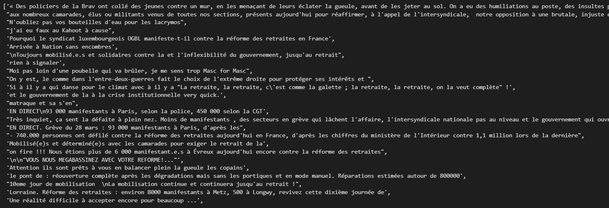

# Twitter NLP

The project consist of analysing a huge amount of tweets about pension reform in France and interpreting the global thinking of french population about this topic using NLP.  
Secondly the project consists of calculate engagement rate on tweets of specific users such as joe bien (the president of the united states) or michel polnareff (french famous singer) using twitter api.  
Master 1 project made for the Natural Language Processing cursus at Efrei Paris.  

## Sentiment-Analysis

Sample of raw text from tweet :

Sample of raw text after cleaning tweets :

Amount of positive, neutral and negative feelings on twitter about pension reform after sentimental analysis :

Functions that calculate engagement rate by users : 

Engagement rates for the President Of The United States : 

